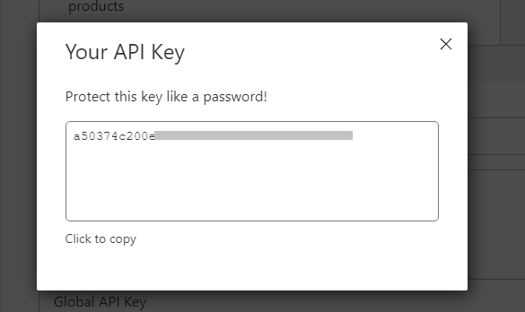
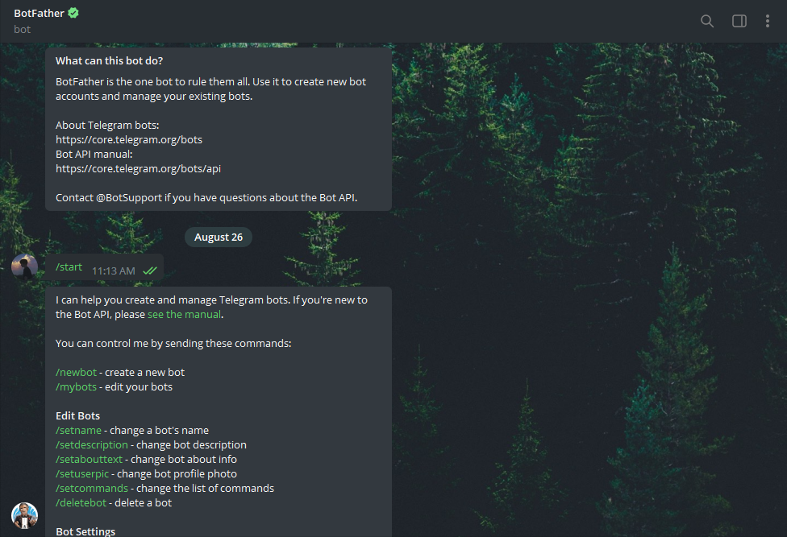
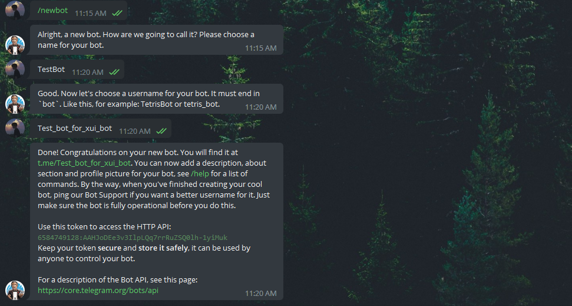
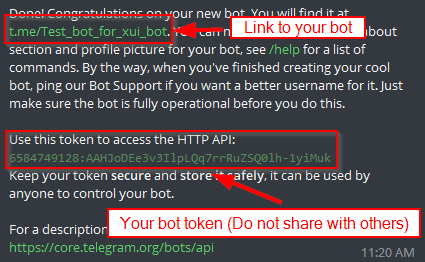

[English](/README.md) | [中文](/README.zh_CN.md) | [Español](/README.es_ES.md) | [Русский](/README.ru_RU.md) | [العربية](#)

<p align="center">
  <picture>
    
  </picture>
</p>

**لوحة ويب متقدمة • مبنية على Xray Core**
**هذا المشروع هو نسخة معدلة (fork) من لوحة 3x-ui.**

[](https://github.com/AghayeCoder/tx-ui/releases)
[](#)
[](#)
[](#)
[](https://www.gnu.org/licenses/gpl-3.0.en.html)

> **إخلاء مسؤولية:** هذا المشروع مخصص للتعلم والتواصل الشخصي فقط، يرجى عدم استخدامه لأغراض غير قانونية، ويرجى عدم
> استخدامه في بيئة إنتاجية.

**إذا كان هذا المشروع مفيدًا لك، يمكنك دعمه بنجمة**:star2:

## التثبيت والترقية

```bash
< <(curl -Ls https://raw.githubusercontent.com/AghayeCoder/tx-ui/master/install.sh)
```

## شهادة SSL

<details>
  <summary>انقر للحصول على تفاصيل شهادة SSL</summary>

### ACME

لإدارة شهادات SSL باستخدام ACME:

1. تأكد من أن نطاقك موجه بشكل صحيح إلى الخادم.
2. قم بتشغيل الأمر `x-ui` في الطرفية، ثم اختر `إدارة شهادات SSL`.
3. ستظهر لك الخيارات التالية:

    - **الحصول على SSL:** للحصول على شهادات SSL.
    - **إلغاء:** لإلغاء شهادات SSL الحالية.
    - **تجديد إجباري:** لفرض تجديد شهادات SSL.
    - **عرض النطاقات الحالية:** لعرض جميع شهادات النطاقات المتاحة على الخادم.
    - **تعيين مسارات الشهادة للوحة:** لتحديد شهادة نطاقك التي ستستخدمها اللوحة.

### Certbot

لتثبيت واستخدام Certbot:

```sh
apt-get install certbot -y
certbot certonly --standalone --agree-tos --register-unsafely-without-email -d yourdomain.com
certbot renew --dry-run
```

### Cloudflare

يتضمن البرنامج النصي للإدارة تطبيقًا مدمجًا لشهادة SSL لـ Cloudflare. لاستخدام هذا البرنامج النصي للتقدم بطلب للحصول على
شهادة، تحتاج إلى ما يلي:

- البريد الإلكتروني المسجل في Cloudflare
- مفتاح API العالمي لـ Cloudflare
- يجب أن يتم توجيه اسم النطاق إلى الخادم الحالي من خلال Cloudflare

**كيفية الحصول على مفتاح API العالمي لـ Cloudflare:**

1. قم بتشغيل الأمر `x-ui` في الطرفية، ثم اختر `شهادة SSL من Cloudflare`.
2. قم بزيارة الرابط: [Cloudflare API Tokens](https://dash.cloudflare.com/profile/api-tokens).
3. انقر على "View Global API Key" (انظر لقطة الشاشة أدناه):
   
4. قد تحتاج إلى إعادة مصادقة حسابك. بعد ذلك، سيتم عرض مفتاح API (انظر لقطة الشاشة أدناه):
   

عند الاستخدام، ما عليك سوى إدخال `اسم النطاق` و`البريد الإلكتروني` و`مفتاح API`. الرسم التوضيحي كما يلي:


</details>

## التثبيت والترقية اليدوي

<details>
  <summary>انقر للحصول على تفاصيل التثبيت اليدوي</summary>

#### الاستخدام

1. لتنزيل أحدث إصدار من الحزمة المضغوطة مباشرة إلى الخادم الخاص بك، قم بتشغيل الأمر التالي:

```bash
ARCH=$(uname -m)
case "${ARCH}" in
  x86_64 | x64 | amd64) XUI_ARCH="amd64" ;; 
  i*86 | x86) XUI_ARCH="386" ;; 
  armv8* | armv8 | arm64 | aarch64) XUI_ARCH="arm64" ;; 
  armv7* | armv7) XUI_ARCH="armv7" ;; 
  armv6* | armv6) XUI_ARCH="armv6" ;; 
  armv5* | armv5) XUI_ARCH="armv5" ;; 
  s390x) echo 's390x' ;; 
  *) XUI_ARCH="amd64" ;; 
esac

wget https://github.com/AghayeCoder/tx-ui/releases/latest/download/x-ui-linux-${XUI_ARCH}.tar.gz
```

2. بمجرد تنزيل الحزمة المضغوطة، قم بتنفيذ الأوامر التالية لتثبيت أو ترقية x-ui:

```bash
ARCH=$(uname -m)
case "${ARCH}" in
  x86_64 | x64 | amd64) XUI_ARCH="amd64" ;; 
  i*86 | x86) XUI_ARCH="386" ;; 
  armv8* | armv8 | arm64 | aarch64) XUI_ARCH="arm64" ;; 
  armv7* | armv7) XUI_ARCH="armv7" ;; 
  armv6* | armv6) XUI_ARCH="armv6" ;; 
  armv5* | armv5) XUI_ARCH="armv5" ;; 
  s390x) echo 's390x' ;; 
  *) XUI_ARCH="amd64" ;; 
esac

cd /root/ 
rm -rf x-ui/ /usr/local/x-ui/ /usr/bin/x-ui
tar zxvf x-ui-linux-${XUI_ARCH}.tar.gz
chmod +x x-ui/x-ui x-ui/bin/xray-linux-* x-ui/x-ui.sh
cp x-ui/x-ui.sh /usr/bin/x-ui
cp -f x-ui/x-ui.service /etc/systemd/system/
mv x-ui/ /usr/local/
systemctl daemon-reload
systemctl enable x-ui
systemctl restart x-ui
```

</details>

## التثبيت باستخدام Docker

<details>
  <summary>انقر للحصول على تفاصيل Docker</summary>

#### الاستخدام

1. **تثبيت Docker:**

   ```bash
   bash <(curl -sSL https://get.docker.com)
   ```

2. **استنساخ مستودع المشروع:**

   ```bash
   git clone https://github.com/AghayeCoder/tx-ui.git
   cd tx-ui
   ```

3. **بدء الخدمة:**

   ```bash
   docker compose up -d
   ```

أضف علامة `--pull always` لجعل Docker يعيد إنشاء الحاوية تلقائيًا إذا تم سحب صورة أحدث.
راجع https://docs.docker.com/reference/cli/docker/container/run/#pull لمزيد من المعلومات.

**أو**

   ```bash
   docker run -itd \
      -e XRAY_VMESS_AEAD_FORCED=false \
      -v $PWD/db/:/etc/x-ui/ \
      -v $PWD/cert/:/root/cert/ \
      --network=host \
      --restart=unless-stopped \
      --name tx-ui \
      ghcr.io/aghayecoder/tx-ui:latest
   ```

4. **التحديث إلى أحدث إصدار:**

   ```bash
   cd tx-ui
   docker compose down
   docker compose pull tx-ui
   docker compose up -d
   ```

5. **إزالة tx-ui من Docker:**

   ```bash
   docker stop tx-ui
   docker rm tx-ui
   cd --
   rm -r tx-ui
   ```

</details>

## إعدادات Nginx

<details>
  <summary>انقر لتكوين الوكيل العكسي (Reverse Proxy)</summary>

#### وكيل Nginx العكسي

```nginx
location / {
    proxy_set_header X-Forwarded-For $proxy_add_x_forwarded_for;
    proxy_set_header X-Forwarded-Proto $scheme;
    proxy_set_header Host $http_host;
    proxy_set_header X-Real-IP $remote_addr;
    proxy_set_header Range $http_range;
    proxy_set_header If-Range $http_if_range; 
    proxy_redirect off;
    proxy_pass http://127.0.0.1:2053;
}
```

#### مسار فرعي لـ Nginx

- تأكد من أن "مسار URI" في إعدادات لوحة `/sub` هو نفسه.
- يجب أن ينتهي `url` في إعدادات اللوحة بـ `/`.

```nginx
location /sub {
    proxy_set_header X-Forwarded-For $proxy_add_x_forwarded_for;
    proxy_set_header X-Forwarded-Proto $scheme;
    proxy_set_header Host $http_host;
    proxy_set_header X-Real-IP $remote_addr;
    proxy_set_header Range $http_range;
    proxy_set_header If-Range $http_if_range; 
    proxy_redirect off;
    proxy_pass http://127.0.0.1:2053;
}
```

</details>

## أنظمة التشغيل الموصى بها

- Ubuntu 22.04+
- Debian 12+
- CentOS 8+
- OpenEuler 22.03+
- Fedora 36+
- Arch Linux
- Parch Linux
- Manjaro
- Armbian
- AlmaLinux 9.5+
- Rocky Linux 9.5+
- Oracle Linux 8+
- OpenSUSE Tubleweed
- Amazon Linux 2023
- Windows x64

## المعماريات والأجهزة المدعومة

<details>
  <summary>انقر للحصول على تفاصيل المعماريات والأجهزة المدعومة</summary>

توفر منصتنا التوافق مع مجموعة متنوعة من المعماريات والأجهزة، مما يضمن المرونة عبر بيئات الحوسبة المختلفة. فيما يلي
المعماريات الرئيسية التي ندعمها:

- **amd64**: هذه المعمارية السائدة هي المعيار لأجهزة الكمبيوتر الشخصية والخوادم، وتستوعب معظم أنظمة التشغيل الحديثة
  بسلاسة.

- **x86 / i386**: معتمدة على نطاق واسع في أجهزة الكمبيوتر المكتبية والمحمولة، تتمتع هذه المعمارية بدعم واسع من العديد من
  أنظمة التشغيل والتطبيقات، بما في ذلك على سبيل المثال لا الحصر أنظمة Windows و macOS و Linux.

- **armv8 / arm64 / aarch64**: مصممة خصيصًا للأجهزة المحمولة والمدمجة المعاصرة، مثل الهواتف الذكية والأجهزة اللوحية،
  وتتمثل هذه المعمارية في أجهزة مثل Raspberry Pi 4 و Raspberry Pi 3 و Raspberry Pi Zero 2/Zero 2 W و Orange Pi 3 LTS
  والمزيد.

- **armv7 / arm / arm32**: تعمل كمعمارية للأجهزة المحمولة والمدمجة القديمة، ولا تزال تستخدم على نطاق واسع في أجهزة مثل
  Orange Pi Zero LTS و Orange Pi PC Plus و Raspberry Pi 2 وغيرها.

- **armv6 / arm / arm32**: موجهة للأجهزة المدمجة القديمة جدًا، هذه المعمارية، على الرغم من أنها أقل انتشارًا، لا تزال
  قيد الاستخدام. تعتمد أجهزة مثل Raspberry Pi 1 و Raspberry Pi Zero/Zero W على هذه المعمارية.

- **armv5 / arm / arm32**: معمارية أقدم مرتبطة بشكل أساسي بالأنظمة المدمجة المبكرة، وهي أقل شيوعًا اليوم ولكن لا يزال من
  الممكن العثور عليها في الأجهزة القديمة مثل إصدارات Raspberry Pi المبكرة وبعض الهواتف الذكية القديمة.

- **s390x**: تُستخدم هذه المعمارية بشكل شائع في أجهزة الكمبيوتر المركزية من IBM وتوفر أداءً وموثوقية عالية لأعباء عمل
  المؤسسات.

</details>

## اللغات

- العربية
- الإنجليزية
- الفارسية
- الصينية التقليدية
- الصينية المبسطة
- اليابانية
- الروسية
- الفيتنامية
- الإسبانية
- الإندونيسية
- الأوكرانية
- التركية
- البرتغالية (البرازيل)

## الميزات

- فرض تثبيت اللوحة عبر HTTPs
- مراقبة حالة النظام
- البحث داخل جميع الاتصالات الواردة والعملاء
- سمة داكنة/فاتحة
- يدعم تعدد المستخدمين وتعدد البروتوكولات
- يدعم البروتوكولات، بما في ذلك VMESS و VLESS و Trojan و Shadowsocks و Dokodemo-door و Socks و HTTP و wireguard
- يدعم بروتوكولات XTLS الأصلية، بما في ذلك RPRX-Direct و Vision و REALITY
- إحصائيات حركة المرور، وحدود حركة المرور، وحدود وقت انتهاء الصلاحية
- قوالب تكوين Xray قابلة للتخصيص
- يدعم الوصول إلى اللوحة عبر HTTPS (اسم نطاق مقدم ذاتيًا + شهادة SSL)
- يدعم طلب شهادة SSL بنقرة واحدة والتجديد التلقائي
- لمزيد من عناصر التكوين المتقدمة، يرجى الرجوع إلى اللوحة
- إصلاح مسارات API (سيتم إنشاء إعداد المستخدم باستخدام API)
- يدعم تغيير التكوينات حسب العناصر المختلفة المتوفرة في اللوحة.
- يدعم تصدير/استيراد قاعدة البيانات من اللوحة
- محدث تطبيقات مدمج

## إعدادات اللوحة الافتراضية

<details>
  <summary>انقر للحصول على تفاصيل الإعدادات الافتراضية</summary>

### اسم المستخدم وكلمة المرور والمنفذ ومسار الويب الأساسي

إذا اخترت عدم تعديل هذه الإعدادات، فسيتم إنشاؤها بشكل عشوائي (لا ينطبق هذا على Docker).

**الإعدادات الافتراضية لـ Docker:**

- **اسم المستخدم:** admin
- **كلمة المرور:** admin
- **المنفذ:** 2053

### إدارة قاعدة البيانات:

يمكنك إجراء نسخ احتياطي واستعادة لقاعدة البيانات بسهولة مباشرة من اللوحة.

- **مسار قاعدة البيانات:**
    - `/etc/x-ui/x-ui.db`

### مسار الويب الأساسي

1. **إعادة تعيين مسار الويب الأساسي:**
    - افتح الطرفية الخاصة بك.
    - قم بتشغيل الأمر `x-ui`.
    - حدد خيار `إعادة تعيين مسار الويب الأساسي`.

2. **إنشاء أو تخصيص المسار:**
    - سيتم إنشاء المسار بشكل عشوائي، أو يمكنك إدخال مسار مخصص.

3. **عرض الإعدادات الحالية:**
    - لعرض إعداداتك الحالية، استخدم الأمر `x-ui settings` في الطرفية أو `عرض الإعدادات الحالية` في `x-ui`.

### توصية أمنية:

- لتعزيز الأمان، استخدم كلمة طويلة وعشوائية في بنية عنوان URL الخاص بك.

**أمثلة:**

- `http://ip:port/*webbasepath*/panel`
- `http://domain:port/*webbasepath*/panel`

</details>

## تقييد IP

<details>
  <summary>انقر للحصول على تفاصيل تقييد IP</summary>

#### الاستخدام

**ملاحظة:** لن يعمل تقييد IP بشكل صحيح عند استخدام نفق IP.

لتمكين وظيفة تقييد IP، تحتاج إلى تثبيت `fail2ban` والملفات المطلوبة باتباع الخطوات التالية:

1. قم بتشغيل الأمر `x-ui` في الطرفية، ثم اختر `إدارة تقييد IP`.
2. سترى الخيارات التالية:

    - **تغيير مدة الحظر:** ضبط مدة الحظر.
    - **رفع الحظر عن الجميع:** رفع جميع عمليات الحظر الحالية.
    - **التحقق من السجلات:** مراجعة السجلات.
    - **حالة Fail2ban:** التحقق من حالة `fail2ban`.
    - **إعادة تشغيل Fail2ban:** إعادة تشغيل خدمة `fail2ban`.
    - **إلغاء تثبيت Fail2ban:** إلغاء تثبيت Fail2ban مع التكوين.

3. أضف مسارًا لسجل الوصول على اللوحة عن طريق تعيين `تكوينات Xray/سجل/سجل الوصول` إلى `./access.log` ثم احفظ وأعد تشغيل
   xray.

</details>

## بوت تليجرام

<details>
  <summary>انقر للحصول على تفاصيل بوت تليجرام</summary>

#### الاستخدام

تدعم لوحة الويب حركة المرور اليومية، وتسجيل الدخول إلى اللوحة، والنسخ الاحتياطي لقاعدة البيانات، وحالة النظام، ومعلومات
العميل، وغيرها من الإشعارات والوظائف من خلال بوت تليجرام. لاستخدام البوت، تحتاج إلى تعيين المعلمات المتعلقة بالبوت في
اللوحة، بما في ذلك:

- توكن تليجرام
- معرف (معرفات) دردشة المسؤول
- وقت الإشعار (بصيغة cron)
- إشعار تاريخ انتهاء الصلاحية
- إشعار سقف حركة المرور
- النسخ الاحتياطي لقاعدة البيانات
- إشعار تحميل وحدة المعالجة المركزية

**صيغة مرجعية:**

- `30 * * * * *` - إشعار في الثانية 30 من كل دقيقة
- `0 */10 * * * *` - إشعار في الثانية الأولى من كل 10 دقائق
- `@hourly` - إشعار كل ساعة
- `@daily` - إشعار يومي (00:00 صباحًا)
- `@weekly` - إشعار أسبوعي
- `@every 8h` - إشعار كل 8 ساعات

### ميزات بوت تليجرام

- تقارير دورية
- إشعار تسجيل الدخول
- إشعار عتبة وحدة المعالجة المركزية
- عتبة لوقت انتهاء الصلاحية وحركة المرور للإبلاغ مسبقًا
- دعم قائمة تقارير العميل إذا تمت إضافة اسم مستخدم تليجرام الخاص بالعميل إلى تكوينات المستخدم
- دعم تقرير حركة مرور تليجرام الذي يتم البحث عنه باستخدام UUID (VMESS/VLESS) أو كلمة المرور (TROJAN) - بشكل مجهول
- بوت قائم على القائمة
- البحث عن عميل عن طريق البريد الإلكتروني (للمسؤول فقط)
- التحقق من جميع الاتصالات الواردة
- التحقق من حالة الخادم
- التحقق من المستخدمين المستنفدين
- تلقي نسخة احتياطية عند الطلب وفي التقارير الدورية
- بوت متعدد اللغات

### إعداد بوت تليجرام

- ابدأ [Botfather](https://t.me/BotFather) في حساب تليجرام الخاص بك:
  

- أنشئ بوتًا جديدًا باستخدام الأمر /newbot: سيطرح عليك سؤالين، اسم واسم مستخدم لبوتك. لاحظ أن اسم المستخدم يجب أن ينتهي
  بكلمة "bot".
  

- ابدأ البوت الذي أنشأته للتو. يمكنك العثور على رابط البوت الخاص بك هنا.
  

- أدخل لوحتك وقم بتكوين إعدادات بوت تليجرام كما هو موضح أدناه:
  

أدخل توكن البوت الخاص بك في حقل الإدخال رقم 3.
أدخل معرف المستخدم في حقل الإدخال رقم 4. ستكون حسابات تليجرام التي تحمل هذا المعرف هي مسؤول البوت. (يمكنك إدخال أكثر من
واحد، فقط افصل بينها بـ ,)

- كيف تحصل على معرف مستخدم تليجرام؟ استخدم هذا [البوت](https://t.me/useridinfobot)، ابدأ البوت وسيعطيك معرف مستخدم
  تليجرام.
  

</details>

## مسارات API

<details>
  <summary>انقر للحصول على تفاصيل مسارات API</summary>

#### الاستخدام

- [توثيق API](https://www.postman.com/aghayecoder/tx-ui/collection/q1l5l0u/tx-ui)
- `/login` مع بيانات المستخدم `POST`: `{username: '', password: ''}` لتسجيل الدخول
- `/panel/api/inbounds` أساس للإجراءات التالية:

| الطريقة | المسار                             | الإجراء                                                     |
|:-------:|------------------------------------|-------------------------------------------------------------|
|  `GET`  | `"/list"`                          | الحصول على جميع الاتصالات الواردة                           |
|  `GET`  | `"/get/:id"`                       | الحصول على اتصال وارد باستخدام inbound.id                   |
|  `GET`  | `"/getClientTraffics/:email"`      | الحصول على حركة مرور العميل باستخدام البريد الإلكتروني      |
|  `GET`  | `"/getClientTrafficsById/:id"`     | الحصول على حركة مرور العميل باستخدام المعرف                 |
|  `GET`  | `"/createbackup"`                  | بوت تليجرام يرسل نسخة احتياطية للمسؤولين                    |
| `POST`  | `"/add"`                           | إضافة اتصال وارد                                            |
| `POST`  | `"/del/:id"`                       | حذف اتصال وارد                                              |
| `POST`  | `"/update/:id"`                    | تحديث اتصال وارد                                            |
| `POST`  | `"/clientIps/:email"`              | عنوان IP للعميل                                             |
| `POST`  | `"/clearClientIps/:email"`         | مسح عنوان IP للعميل                                         |
| `POST`  | `"/addClient"`                     | إضافة عميل إلى اتصال وارد                                   |
| `POST`  | `"/:id/delClient/:clientId"`       | حذف عميل باستخدام clientId*                                 |
| `POST`  | `"/updateClient/:clientId"`        | تحديث عميل باستخدام clientId*                               |
| `POST`  | `"/updateClientTraffic/:email"`    | تحديث حركة مرور العميل بالبريد الإلكتروني، القيم بالبايت    |
| `POST`  | `"/:id/resetClientTraffic/:email"` | إعادة تعيين حركة مرور العميل                                |
| `POST`  | `"/resetAllTraffics"`              | إعادة تعيين حركة مرور جميع الاتصالات الواردة                |
| `POST`  | `"/resetAllClientTraffics/:id"`    | إعادة تعيين حركة مرور جميع العملاء في اتصال وارد            |
| `POST`  | `"/delDepletedClients/:id"`        | حذف العملاء المستنفدين للاتصال الوارد (-1: الكل)            |
| `POST`  | `"/onlines"`                       | الحصول على المستخدمين المتصلين (قائمة بالبريد الإلكتروني)   |
| `POST`  | `"/depleted"`                      | الحصول على المستخدمين المستنفدين (قائمة بالبريد الإلكتروني) |
| `POST`  | `"/disabled"`                      | الحصول على المستخدمين المعطلين (قائمة بالبريد الإلكتروني)   |

- يجب ملء حقل `clientId` بـ:

- `client.id` لـ VMESS و VLESS
- `client.password` لـ TROJAN
- `client.email` لـ Shadowsocks \.
  `/panel/api/server` أساس للإجراءات التالية:

| الطريقة | المسار                  | الإجراء                |
|:-------:|-------------------------|------------------------|
|  `GET`  | `"/status"`             | الحصول على حالة الخادم |
|  `GET`  | `"/restartXrayService"` | إعادة تشغيل xray-core  |

[](https://app.getpostman.com/run-collection/5146551-dda3cab3-0e33-485f-96f9-d4262f437ac5?action=collection%2Ffork&source=rip_markdown&collection-url=entityId%3D5146551-dda3cab3-0e33-485f-96f9-d4262f437ac5%26entityType%3Dcollection%26workspaceId%3Dd64f609f-485a-4951-9b8f-876b3f917124)

</details>

## متغيرات البيئة

<details>
  <summary>انقر للحصول على تفاصيل متغيرات البيئة</summary>

#### الاستخدام

| المتغير        |   النوع   | الافتراضي   |
|----------------|:---------:|:------------|
| XUI_LOG_LEVEL  |  "debug"  | "info"      | "warn" | "error" | "info"        |
| XUI_DEBUG      | `boolean` | `false`     |
| XUI_BIN_FOLDER | `string`  | "bin"       |
| XUI_DB_FOLDER  | `string`  | "/etc/x-ui" |
| XUI_LOG_FOLDER | `string`  | "/var/log"  |

مثال:

```sh
XUI_BIN_FOLDER="bin" XUI_DB_FOLDER="/etc/x-ui" go build main.go
```

</details>

## واجهة المستخدم للاشتراك

يمكنك استخدام هذا المستودع لإنشاء واجهة مستخدم للاشتراك
للوحتك [TX-UI Theming Hub](https://github.com/AghayeCoder/TX-ThemeHub)

## شكر وتقدير

- [@Incognito-Coder](https://github.com/incognito-coder) لمساهمته في هذا المشروع
- شكر خاص لجميع المساهمين

## إقرار

- [Iran v2ray rules](https://github.com/chocolate4u/Iran-v2ray-rules) (الترخيص: **GPL-3.0**): _قواعد توجيه محسنة لـ
  v2ray/xray وعملاء v2ray/xray مع نطاقات إيرانية مدمجة وتركيز على الأمان وحظر الإعلانات._
- [Russia v2ray rules](https://github.com/runetfreedom/russia-v2ray-rules-dat) (الترخيص: **GPL-3.0**): _يحتوي هذا
  المستودع على قواعد توجيه V2Ray محدثة تلقائيًا بناءً على بيانات النطاقات والعناوين المحظورة في روسيا._

## عدد النجوم عبر الزمن

[](https://starchart.cc/AghayeCoder/tx-ui)
